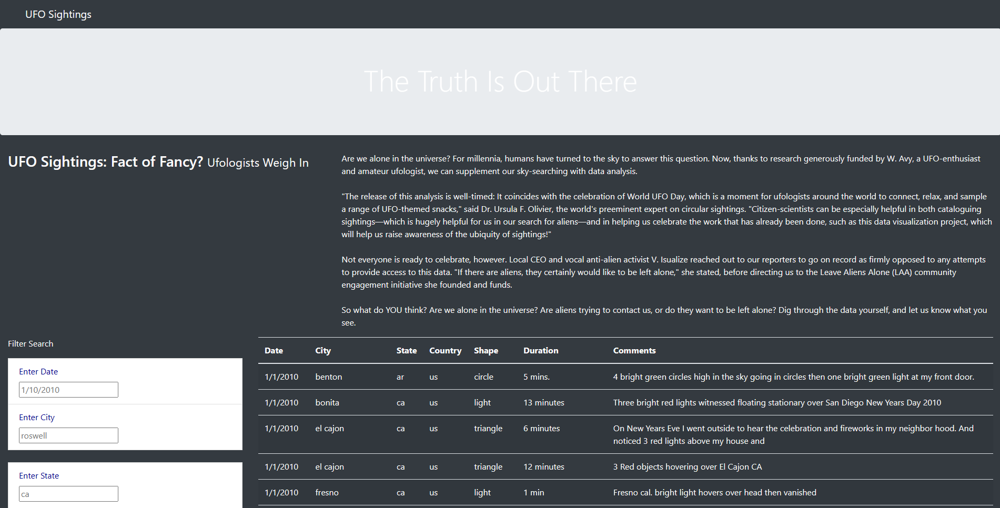
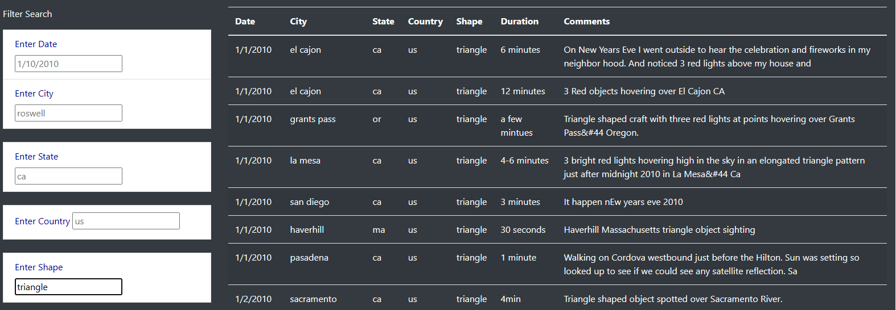

# UFOs Analysis with JavaScript

## Overview of the UFOs analysis

### Background

JavaScript is a text-based programming language used both on the client-side and server-side that allows to make web pages interactive. Then, using JavaScript and HTML were required in a webpage and dynamic table to provide a more in-depth analysis of UFO sightings by allowing users to filter for multiple criteria at the same time. In addition to the date, adding table filters for the city, state, country, and shape.

### Purpose

The main purpose of this project is provide an analysis of UFO sightings by allowing users to filter for multiple criteria at the same time using JavaScript and HTML adding table filters for the city, state, country, and shape.

## Filter UFO sightings on multiple criteria - Results

Using JavaScript and HTML, it was modified the code in the index.html file to create more table filters. In addition, it was added filters for the city, state, country, and shape, as shown in the following image:

Also, using JavaScript, it was replaced the handleClick() function in the app.js file with a new function that saves the element, value, and id of the filter that was changed. Then, it was created a new function to loop through the dataset and keep only the results that match the search criteria. The webpage will be updated with the search criteria after pressing "Enter".

In summary, once entering the website our client will see the basic opening and title with the picture at the top, as the client scrolls down they will begin to see all the data and filters that are available as shown in the image below. There are a total of 5 different filters to choose from; the date, city, state, country & shape. Customer could choose any of these filters entering in the search bar, then the HTML page will show all of the sightings for that specific search. Multiple filters can be entered at the same time to further inspect the data in the specific search bar that is entered. In the image below, it possible verify the search bar with a filter applied under "Enter Shape" as "Triangle and how the date on the right is filteres with that condition.

## Summary - Recommendations

It was created a page that looks clean and allows the user to filter through the different sitings in our data set using the search bars created. One big drawback about the search bar is trying to validate the sitings that happened which can be better described in the data. If user had how many people were at the siting would be a helpful element to validating the claims. Having as much data as possible for website would make it as good as it can possible be. 

On the other side, some recomendations for improving this website include: 
    1. Have more data with more information including how many people were at the site 
    2. Add another filter to find the sitings by lengt and last but not least have a site that would be constantly updating the data adding new sitings to the page.

### Conclusion 

In conclusion, JavaScript provide speed and simplicity in the data managment, and making the webpage more dynamic and add special effects on pages like rollover, roll out and many types of graphics. Datas as UFOs, could be analyzed deeply by allowing users to filter for multiple criteria at the same time using JavaScript and HTML adding table filters for the city, state, country, and shape.
